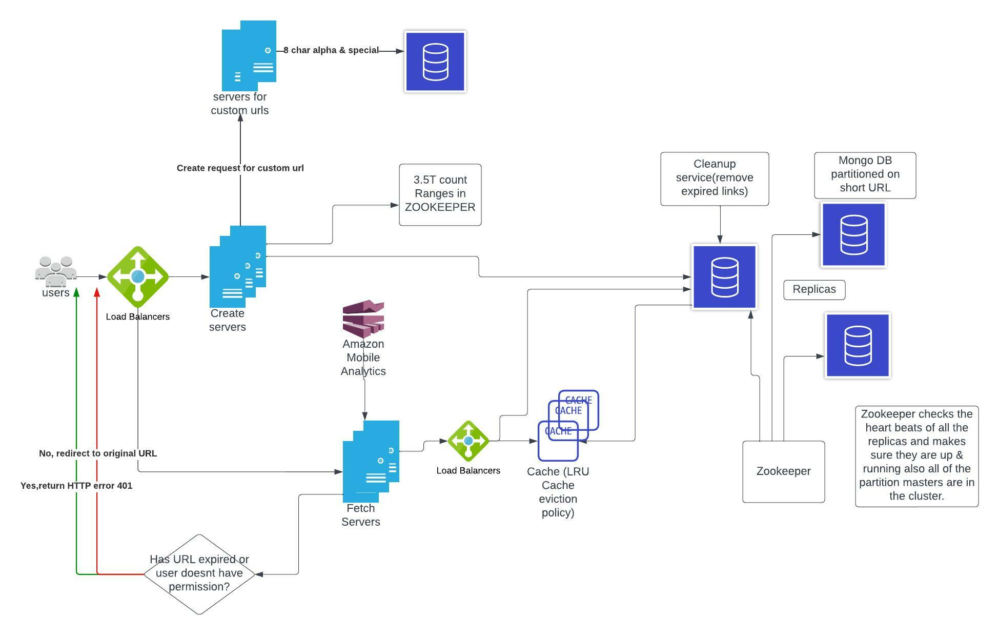
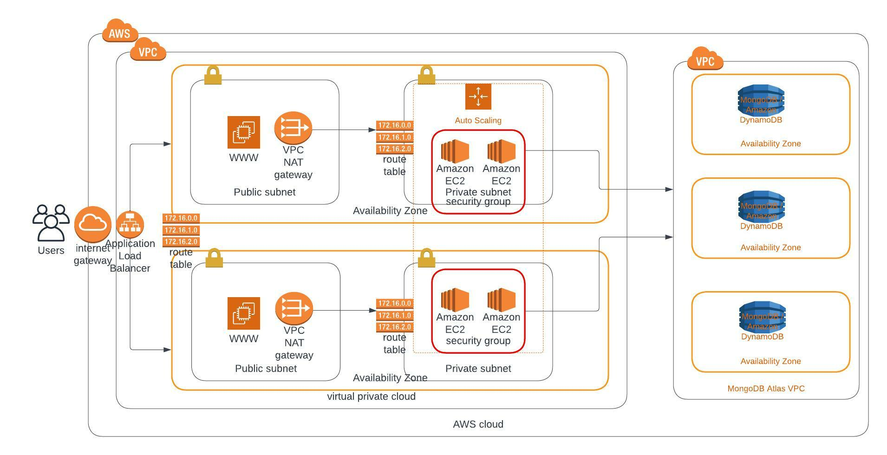
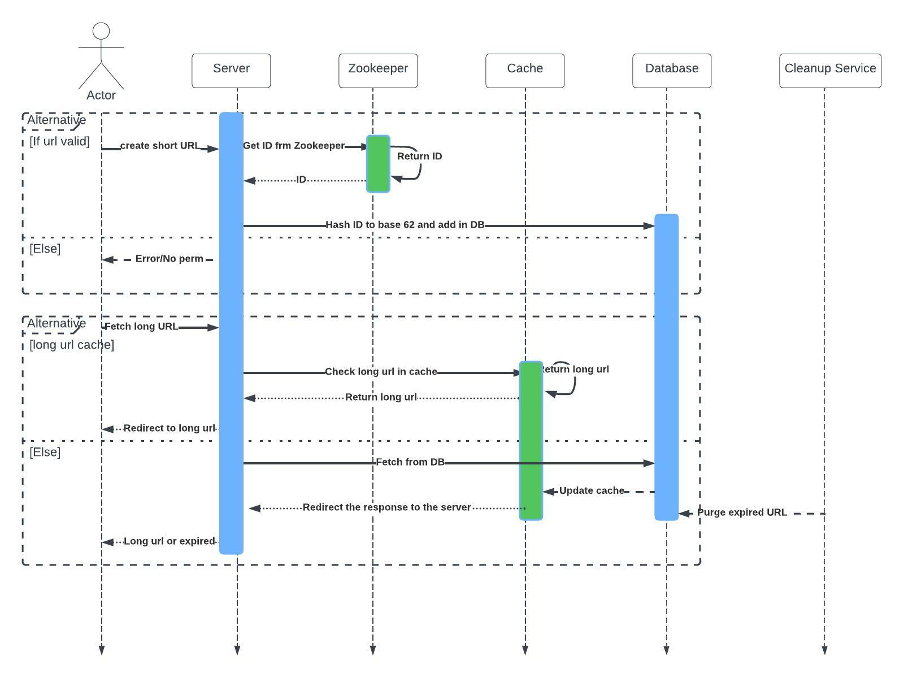

URL shortener service creates a short URL against a long URL. However, when the user clicks on the tiny URL, he gets redirected to the original URL.

When a user makes a request to shorten a URL, the create URL service endpoint is called through the load balancer. Upon the request reaching the server, it requests the distribution system manager(Zookeeper) to give it an ID token. The ID is then hashed in `base62` then forwarded for storage in the database.

To get the long URL, the fetch service is invoked and the request is sent from the server to the cache memory. If the URL exists in the Cache memory, it is returned to the user and gets redirected to the original long URL. Otherwise, if it does not exist in the cache the request hits the database. The URL is fetched and is updated into the cache and also returned back.
The cache uses the least recently used policy. We store 20% of data into the cache to reduce
too much traffic into the database and at the same time make the system faster.
The hashing is done in base62 and 7 characters are picked. Combination of `A-Z, a-z, 0-9 = 62`.
Thus base 62. The system can create 3.5 Trillion unique combinations.

### Traffic

> Since we are getting 8k requests per second, this is the amount of traffic it can handle.
> - 1 sec = 8000 requests
> - 8000 * 60 secs = 480k requests per min
> - 8000 * 60 * 60 = 28 million per hour
> - 8000 * 60 * 60 * 24 = 691 million per day
> - 8000 * 60 * 60 * 24 * 30 = 20 billion a month

### Custom tiny URLs
Users can also provide their own tiny URLs of their choice. The user is allowed to choose
alphanumerics and the “special characters” like `$-_.+!*’(),.` in a tiny URL let us imagine a
minimum of 8 characters. When a user provides a custom URL we store it in another instance of
the database(different from where the system generates a short URL against the original URL)
and treat these short URLs as special URLs. When we get redirection requests we divert these
requests to special instances of web servers.

## Deployment Diagram
To deploy the system to AWS, we need to create an AWS cloud. Then create a private
virtual cloud network(VPC) Internet gateway is created that allows access to the VPC.
Then two availabilities zones are created for high availability. A load balancer is added
in front of the AZs that distribute the load. Anything that has been done to AZ 1 the
same has to be done to AZ 2. Public and private subnets are created in both timezones
totaling 4. Public subnets contain web servers and NAT gateways used to communicate
with the private subnets. Route tables are used in the communication between the
public to the private subnet and back since the private subnets are not exposed to the
world. The private subnets contain auto-scaling EC2 servers that run the app servers.
Security groups are applied to the EC2 servers for more security. Then finally the private
subnet connects to the database.

## Sequence Diagram
This is a simple sequence diagram that ilustrates the activities that happen when requests are made by the user.

